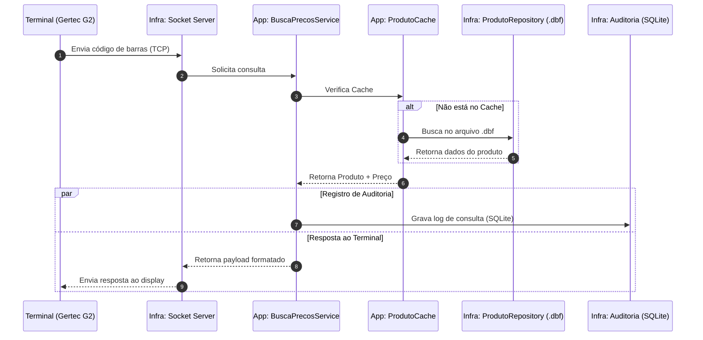

# 🔍 BuscaPreco - Backend para Terminais de Consulta

O **BuscaPreco** é uma solução robusta de backend local desenvolvida em **.NET 8**, projetada para integrar terminais físicos de consulta de preço (como o **Gertec Busca Preço G2 E**) com bases de dados legadas em formato **.dbf**. 

A aplicação opera de forma discreta na bandeja do sistema (**System Tray**) do Windows, garantindo alta disponibilidade e respostas imediatas via protocolo TCP/IP, com total rastreabilidade através de logs detalhados e auditoria em SQLite.

---

## 🏗️ Arquitetura do Sistema

O projeto adota os princípios da **Clean Architecture**, promovendo a separação de preocupações, facilidade de testes e independência de frameworks externos.

### Estrutura de Pastas

```text
BuscaPreco/
├── src/
│   ├── Domain/          # Núcleo de negócio: Entidades e Contratos (Interfaces)
│   ├── Application/     # Casos de uso: Serviços, DTOs e Orquestração
│   ├── Infrastructure/  # Detalhes técnicos: Acesso a dados (DBF/SQLite), Sockets, E-mail
│   ├── Presentation/    # Interface com usuário: WinForms e System Tray
│   └── CrossCutting/    # Preocupações transversais: Logging (Serilog), Validações
├── tests/
│   └── BuscaPreco.E2E/  # Testes de ponta a ponta (End-to-End) e Integração
├── scripts/             # Utilitários de automação e manutenção
└── BuscaPreco.sln       # Solução principal do Visual Studio
```

### Componentes Principais

| Camada | Responsabilidade |
| :--- | :--- |
| **Domain** | Define o modelo de `Produto` e as interfaces de repositório. |
| **Application** | Gerencia o cache de produtos, monitora atividade do terminal e orquestra a busca. |
| **Infrastructure** | Implementa o servidor de Socket TCP, leitura de arquivos `.dbf` e persistência de auditoria em SQLite. |
| **Presentation** | Gerencia o ciclo de vida da aplicação no Windows e formulários de configuração/relatórios. |

---

## 🔄 Fluxo de Operação

O diagrama abaixo ilustra o ciclo de vida de uma consulta de preço, desde o acionamento no terminal físico até a resposta visual para o cliente.



---

## 🚀 Guia de Instalação e Configuração

### Pré-requisitos

*   **Runtime**: [.NET 8 Desktop Runtime](https://dotnet.microsoft.com/download/dotnet/8.0) (Windows x64).
*   **Desenvolvimento**: Visual Studio 2022 ou VS Code com C# Dev Kit.
*   **Base de Dados**: Acesso de leitura ao arquivo `.dbf` do sistema de automação comercial.

### Configuração Inicial

1.  Clone o repositório:
    ```powershell
    git clone https://github.com/saulooliveira/mpm-app-busca-preco.git
    ```
2.  Prepare o arquivo de configuração:
    ```powershell
    copy .\BuscaPreco\config.example.yaml .\BuscaPreco\config.yaml
    ```
3.  Edite o `config.yaml` com as informações do seu ambiente:
    *   `DbfPath`: Caminho absoluto para o arquivo de produtos.
    *   `Porta`: Porta TCP (padrão Gertec é 9100 ou conforme configurado no terminal).
    *   `Email`: Configurações de SMTP para envio de relatórios diários.

---

## 🛠️ Desenvolvimento e Build

### Comandos Úteis (CLI)

*   **Restaurar Dependências**:
    ```powershell
    dotnet restore
    ```
*   **Compilar em Modo Release**:
    ```powershell
    dotnet build -c Release
    ```
*   **Executar Testes E2E**:
    ```powershell
    dotnet test .\BuscaPreco\tests\BuscaPreco.E2E\BuscaPreco.E2E.csproj
    ```
*   **Publicar Executável Único**:
    ```powershell
    dotnet publish .\BuscaPreco\BuscaPreco.csproj -c Release -r win-x64 --self-contained true -p:PublishSingleFile=true
    ```

---

## 📊 Funcionalidades de Auditoria

O **BuscaPreco** não apenas responde consultas, mas também gera inteligência de negócio:

*   **Logs em Tempo Real**: Utiliza Serilog para registrar eventos do sistema e erros de comunicação.
*   **Banco de Dados de Consultas**: Todas as buscas (sucesso ou falha) são gravadas em um banco SQLite local (`buscapreco.db`).
*   **Relatórios**: Interface integrada para visualização de produtos mais consultados e horários de pico.
*   **Alertas**: Notificações via Webhook ou E-mail para produtos não encontrados na base.

---

## ⚖️ Licença

Este projeto está sob a licença descrita no arquivo [LICENSE](LICENSE).

---
*Desenvolvido para garantir agilidade e confiabilidade no ponto de venda.*
