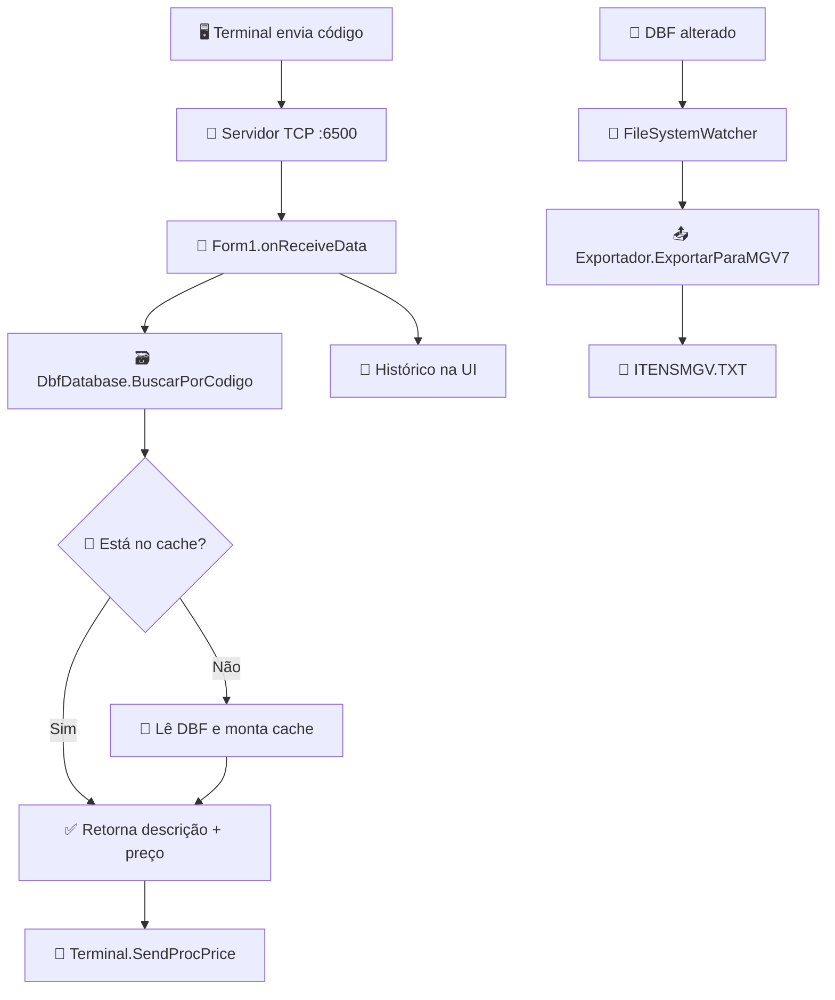

# 🚀 BuscaPreço Hub

Aplicação desktop em **Windows Forms (.NET Framework 4.8)** para consulta de preços em tempo real via terminais de rede (socket TCP), com leitura de base **DBF**, cache em memória e exportação de itens no formato **MGV7**.

> 💡 Em resumo: o sistema recebe o código do produto do terminal, busca no DBF, retorna descrição + preço formatado e mantém um histórico operacional na interface.

---

## 🎯 Contexto do Projeto

O projeto foi construído para operar em cenários de loja/atendimento onde terminais consultam preço de itens rapidamente. O app também:

- monitora alterações no arquivo DBF de cadastro;
- atualiza cache de consulta automaticamente;
- exporta arquivo `ITENSMGV.TXT` para integração com equipamentos/sistemas que consomem layout MGV7;
- permite enviar parâmetros/configurações e comandos de atualização/restart para os terminais conectados.

---

## 🗂️ Estrutura de Pastas

```text
.
├── BuscaPreco.sln                  # Solution principal (Visual Studio)
├── README.md                       # Documentação do projeto
└── BuscaPreco/
    ├── BuscaPreco.csproj           # Projeto WinForms (.NET Framework 4.8)
    ├── Program.cs                  # Ponto de entrada da aplicação
    ├── Form1.cs                    # Tela principal e orquestração do fluxo
    ├── Form1.Designer.cs           # Componentes visuais da tela principal
    ├── Servidor.cs                 # Servidor TCP (porta 6500) e gestão de conexões
    ├── Terminal.cs                 # Protocolo/comunicação com os terminais
    ├── DbfConnection.cs            # Cópia de DBF, cache e consultas de produto
    ├── DBConfig.cs                 # Leitura de configuração YAML
    ├── Exportador.cs               # Exportação de produtos para layout MGV7
    ├── Configuracoes.cs            # Modelo/protocolo de configuração dos terminais
    ├── Produto.cs                  # Modelo de produto para exportação
    ├── Log.cs                      # Logger em arquivo diário (app_yyyy-MM-dd.log)
    ├── config.yaml                 # Caminho da base DBF
    ├── app.config                  # Configurações da aplicação .NET
    ├── packages.config             # Dependências NuGet
    ├── Form1.resx                  # Recursos da interface
    └── Properties/                 # Metadados, recursos e settings da aplicação
```

---

## 🔄 Fluxo do Sistema (Mermaid)



---

## 🧰 Tecnologias Utilizadas

- **C# / .NET Framework 4.8**
- **Windows Forms** (UI desktop)
- **Sockets TCP** (`System.Net.Sockets`) para comunicação com terminais
- **dBASE.NET** para leitura de arquivos `.DBF`
- **YamlDotNet** para configuração via `config.yaml`
- **MSBuild / Visual Studio Solution**

---

## ⚙️ Configuração e Instalação

### ✅ Pré-requisitos

- Windows com **.NET Framework 4.8 Developer Pack**
- Visual Studio 2019+ (ou Build Tools compatíveis)
- NuGet CLI (opcional, mas recomendado)
- Acesso ao arquivo DBF de produtos

### 1) Clonar o repositório

```bash
git clone <URL_DO_REPOSITORIO>
cd mpmp-app-busca-preco
```

### 2) Restaurar dependências

Opção com NuGet CLI:

```bash
nuget restore BuscaPreco.sln
```

Ou via Visual Studio:

- Abra `BuscaPreco.sln`
- Clique com botão direito na solução → **Restore NuGet Packages**

### 3) Ajustar configuração do DBF

Edite `BuscaPreco/config.yaml` com o caminho real do seu arquivo:

```yaml
DbfConfig:
  DbfFilePath: "C:/caminho/para/CADITE.DBF"
```

### 4) Compilar

```bash
msbuild BuscaPreco.sln /p:Configuration=Release
```

### 5) Executar

- Pelo Visual Studio: **F5**
- Ou executando o `.exe` gerado em `BuscaPreco/bin/Release/`

---

## 🧪 Operação do Sistema

1. A aplicação sobe um servidor TCP na porta **6500**.
2. Terminais conectam e enviam comandos/códigos de produto.
3. O app consulta o DBF (com cache em memória) e responde ao terminal.
4. A tela mostra terminais conectados e histórico de consultas.
5. Quando o DBF muda, ocorre exportação automática para `ITENSMGV.TXT`.

---

## 🛠️ Boas Práticas de Manutenibilidade

- ✅ **Centralize configurações** em `config.yaml` e evite caminhos hardcoded no código.
- ✅ **Isole responsabilidades** (UI em `Form1`, comunicação em `Servidor/Terminal`, dados em `DbfDatabase`).
- ✅ **Mantenha logs úteis** com contexto de erro para troubleshooting em produção.
- ✅ **Padronize contratos de protocolo** dos comandos dos terminais em documentação interna.
- ✅ **Evolução sugerida**: migrar de `ArrayList` para `List<T>` e revisar controle de thread/cancelamento para maior segurança.

---

## 📌 Observações

- O projeto é legado WinForms e depende de bibliotecas NuGet específicas (`dBASE.NET`, `YamlDotNet`).
- Para ambientes de produção, valide permissões de leitura/escrita no diretório da aplicação (logs e exportações).
- A disponibilidade e integridade do arquivo DBF impactam diretamente as consultas de preço.

---

## 🤝 Contribuição

1. Crie uma branch de feature/correção.
2. Faça commits pequenos e descritivos.
3. Valide build local antes de abrir PR.
4. Atualize este README em caso de mudança de arquitetura/fluxo.

