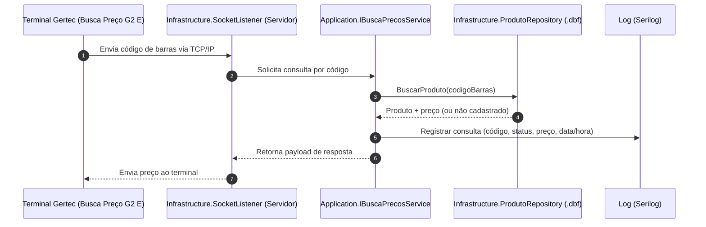

# BuscaPreco

O **BuscaPreco** é um backend local para supermercados, executado em **Windows (System Tray)**, que integra o terminal físico **Gertec Busca Preço G2 E** com a base local de produtos em **.dbf**. O objetivo é permitir que o cliente consulte preço no totem e receba resposta imediata via rede TCP/IP, com rastreabilidade por logs.

## Arquitetura e estrutura do projeto

A solução está organizada em camadas seguindo princípios de **Clean Architecture**.

```text
BuscaPreco/
├── src/
│   ├── Domain/                      # Núcleo de negócio (entidades e contratos de domínio)
│   │   ├── Entities/
│   │   └── Interfaces/
│   ├── Application/                 # Casos de uso, orquestração e contratos de aplicação
│   │   ├── Configurations/
│   │   ├── Interfaces/
│   │   └── Services/
│   ├── Infrastructure/              # Implementações técnicas (DBF, socket, e-mail, adapters)
│   │   ├── Data/
│   │   ├── HttpClients/
│   │   ├── Repositories/
│   │   ├── Scrapers/
│   │   └── Services/
│   ├── Presentation/                # Camada de interface (WinForms + System Tray)
│   │   └── WindowsForms/
│   └── CrossCutting/                # Utilitários transversais (logs, validações)
├── Tests/
│   ├── UnitTests/                   # Espaço para testes unitários
│   └── IntegrationTests/            # Espaço para testes de integração
├── BuscaPreco.csproj                # Projeto WinForms .NET Framework 4.8
├── config.example.yaml              # Template versionável de configuração
└── config.yaml                      # Configuração local (ignorada por segurança)
```

### Responsabilidade por camada

- **Domain**: representa regras de negócio puras e contratos centrais, sem dependência de tecnologia.
- **Application**: implementa os fluxos de consulta de preço e integra os contratos de domínio com a infraestrutura.
- **Infrastructure**: concentra acesso técnico (socket TCP/IP, leitura DBF com dBASE.NET, serviços auxiliares).
- **Presentation**: inicialização da aplicação desktop, contexto de tray e interação com operador.
- **CrossCutting**: componentes utilitários reutilizados entre camadas.

## Fluxo de consulta de preço (Mermaid)



## Setup local

### 1) Pré-requisitos

- Windows com **.NET Framework 4.8 Developer Pack** instalado.
- **Visual Studio 2022** (ou Build Tools) com MSBuild.
- **NuGet CLI** disponível no PATH.

### 2) Restaurar pacotes

```bash
nuget restore BuscaPreco.sln
```

### 3) Configuração de ambiente

1. Copie o arquivo de exemplo:

```bash
copy BuscaPreco\config.example.yaml BuscaPreco\config.yaml
```

2. Ajuste os campos no `config.yaml` para seu ambiente local:
   - caminho do arquivo DBF;
   - porta do terminal;
   - SMTP e credenciais para relatório diário;
   - parâmetros de log.

### 4) Compilar

```bash
msbuild BuscaPreco.sln /t:Build /p:Configuration=Release /p:Platform="Any CPU"
```

### 5) Executar

- Execute o binário gerado em `BuscaPreco\bin\Release\`.
- A aplicação iniciará em **System Tray** e ficará escutando a porta configurada.
