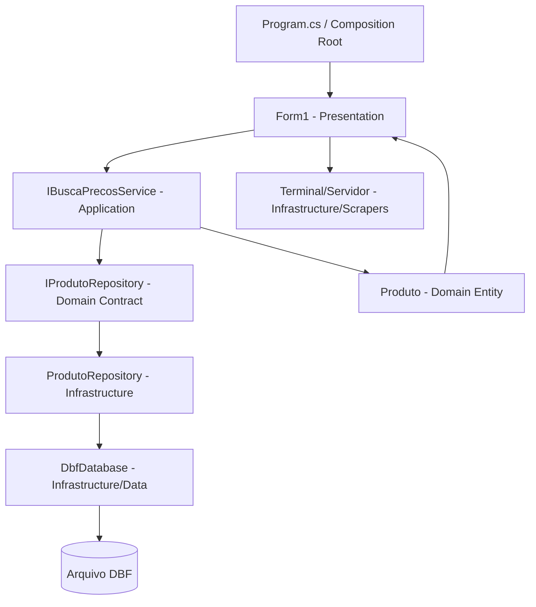

# BuscaPreco

Aplicação desktop em **C#/.NET** para consulta de preços de produtos a partir de base DBF e integração com terminais de consulta. O projeto foi reorganizado para uma estrutura orientada a **Clean Architecture**, separando responsabilidades de domínio, aplicação, infraestrutura e componentes transversais.

## Arquitetura

```text
BuscaPreco/
├── BuscaPreco.csproj
├── src/
│   ├── Domain/
│   │   ├── Entities/
│   │   │   ├── Produto.cs
│   │   │   └── Configuracoes.cs
│   │   └── Interfaces/
│   │       └── IProdutoRepository.cs
│   ├── Application/
│   │   ├── Services/
│   │   │   └── BuscaPrecosService.cs
│   │   └── Interfaces/
│   │       └── IBuscaPrecosService.cs
│   ├── Infrastructure/
│   │   ├── Data/
│   │   │   ├── DBConfig.cs
│   │   │   └── DbfConnection.cs
│   │   ├── Repositories/
│   │   │   ├── ProdutoRepository.cs
│   │   │   └── Exportador.cs
│   │   ├── HttpClients/
│   │   │   └── PrecosHttpClient.cs
│   │   └── Scrapers/
│   │       ├── Servidor.cs
│   │       └── Terminal.cs
│   ├── CrossCutting/
│   │   ├── Logger.cs
│   │   └── Validators.cs
│   └── Presentation/
│       └── WindowsForms/
│           ├── Form1.cs
│           ├── Form1.Designer.cs
│           └── Form1.resx
├── Tests/
│   ├── UnitTests/
│   └── IntegrationTests/
├── appsettings.json
└── Program.cs
```

### Propósito das camadas

- **Domain**: regras de negócio centrais e contratos (sem dependência de infraestrutura).
- **Application**: orquestração de casos de uso (serviços de aplicação que dependem de contratos do Domain).
- **Infrastructure**: implementação técnica (DBF, repositórios, comunicação com terminal, integrações externas).
- **CrossCutting**: utilitários compartilhados (log, validações, helpers).
- **Presentation**: interface WinForms e interação com usuário.

## Fluxo de busca de preço



## Setup e instalação

> Pré-requisitos: .NET SDK/Build Tools compatível com o framework do projeto e dependências restauráveis pelo NuGet.

### 1) Restaurar pacotes

```bash
nuget restore BuscaPreco.sln
```

ou

```bash
dotnet restore BuscaPreco.sln
```

### 2) Banco/migrations (quando aplicável)

Atualmente o projeto usa DBF (sem EF Core em produção). Caso evolua para EF Core:

```bash
dotnet ef database update
```

### 3) Executar a aplicação

Com Visual Studio (recomendado para WinForms) ou via CLI:

```bash
dotnet run --project BuscaPreco/BuscaPreco.csproj
```

## Script de referência para reorganização

Há um script utilitário em:

```text
scripts/reorganizar-clean-architecture.sh
```

Ele documenta a sequência de criação de diretórios e movimentação de arquivos para a estrutura limpa.
