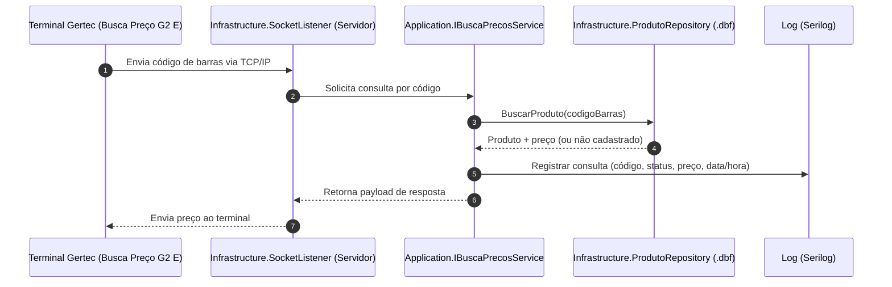

# BuscaPreco

O **BuscaPreco** é um backend local para supermercados, executado em **Windows (System Tray)**, que integra o terminal físico **Gertec Busca Preço G2 E** com a base local de produtos em **.dbf**. O objetivo é permitir que o cliente consulte preço no totem e receba resposta imediata via rede TCP/IP, com rastreabilidade por logs.

## Arquitetura e estrutura do projeto

A solução está organizada em camadas seguindo princípios de **Clean Architecture**.

```text
BuscaPreco/
├── src/
│   ├── Domain/                      # Núcleo de negócio (entidades e contratos de domínio)
│   │   ├── Entities/
│   │   └── Interfaces/
│   ├── Application/                 # Casos de uso, orquestração e contratos de aplicação
│   │   ├── Configurations/
│   │   ├── Interfaces/
│   │   └── Services/
│   ├── Infrastructure/              # Implementações técnicas (DBF, socket, e-mail, adapters)
│   │   ├── Data/
│   │   ├── HttpClients/
│   │   ├── Repositories/
│   │   ├── Scrapers/
│   │   └── Services/
│   ├── Presentation/                # Camada de interface (WinForms + System Tray)
│   │   └── WindowsForms/
│   └── CrossCutting/                # Utilitários transversais (logs, validações)
├── Tests/
│   ├── UnitTests/                   # Espaço para testes unitários
│   └── IntegrationTests/            # Espaço para testes de integração
├── BuscaPreco.csproj                # Projeto WinForms (.NET 8 / net8.0-windows)
├── config.example.yaml              # Template versionável de configuração
└── config.yaml                      # Configuração local (ignorada por segurança)
```

### Responsabilidade por camada

- **Domain**: representa regras de negócio puras e contratos centrais, sem dependência de tecnologia.
- **Application**: implementa os fluxos de consulta de preço e integra os contratos de domínio com a infraestrutura.
- **Infrastructure**: concentra acesso técnico (socket TCP/IP, leitura DBF com dBASE.NET, serviços auxiliares).
- **Presentation**: inicialização da aplicação desktop, contexto de tray e interação com operador.
- **CrossCutting**: componentes utilitários reutilizados entre camadas.

## Fluxo de consulta de preço (Mermaid)



## Setup local

As instruções abaixo mostram como preparar, compilar e executar o projeto em uma máquina Windows. Uso recomendado em PowerShell (Windows PowerShell v5.1) ou via Visual Studio.

### 1) Pré-requisitos

- Windows com o .NET 8 SDK (ou .NET Desktop Runtime para Windows) instalado. Verifique o TargetFramework em `BuscaPreco.csproj` se tiver dúvidas.
- Visual Studio 2022 (ou Build Tools) com MSBuild (opcional).
- dotnet CLI (incluído no .NET 8 SDK) disponível no PATH — recomendado para restore/build/run.

Observação: este projeto usa .NET 8 (TargetFramework `net8.0-windows`). Certifique-se de ter o .NET 8 SDK/Runtime instalado; abra `BuscaPreco.csproj` no Visual Studio para confirmar o TargetFramework se necessário.

### 2) Restaurar pacotes

Usando dotnet CLI (PowerShell):

```powershell
dotnet restore .\BuscaPreco.sln
```

Ou abra a solução no Visual Studio e selecione: Project -> Restore NuGet Packages.

### 3) Configuração de ambiente

1. Copie o arquivo de exemplo para criar sua configuração local (PowerShell):

```powershell
Copy-Item -Path .\BuscaPreco\config.example.yaml -Destination .\BuscaPreco\config.yaml
```

2. Edite `BuscaPreco\config.yaml` e ajuste os valores para seu ambiente:
- caminho do arquivo DBF
- porta TCP do terminal
- SMTP e credenciais (se usar relatório por e-mail)
- parâmetros de log (nível, arquivo, rota)

Importante: `config.yaml` está no .gitignore por segurança; não comite credenciais.

### 4) Compilar

Via dotnet CLI (PowerShell):

```powershell
dotnet build .\BuscaPreco.sln -c Release
```

Ou use o Visual Studio: abra a solução `BuscaPreco.sln` e escolha Build -> Build Solution (ajuste Configuration/Platform conforme necessário).

Para gerar artefatos prontos para distribuição use `dotnet publish`:

```powershell
dotnet publish .\BuscaPreco\BuscaPreco.csproj -c Release -r win-x64 -o .\publish
```

Após a build/publish, os caminhos típicos de saída são:

- `BuscaPreco\bin\Release\` ou
- `BuscaPreco\bin\Release\net8.0-windows\` ou
- `BuscaPreco\publish\` (quando usar `dotnet publish`)

### 5) Executar

1. Verifique se `BuscaPreco\config.yaml` existe e está configurado.

2a. Executar diretamente com dotnet (útil para desenvolvimento):

```powershell
dotnet run --project .\BuscaPreco\BuscaPreco.csproj --configuration Release
```

2b. Executar o binário gerado após build/publish (exemplo PowerShell):

```powershell
Start-Process -FilePath .\BuscaPreco\bin\Release\net8.0-windows\BuscaPreco.exe
```

Ou execute o executável dentro da pasta `publish` se tiver usado `dotnet publish`.

A aplicação roda em System Tray e ficará escutando a porta configurada para atender o terminal (TCP/IP).

### 6) Troubleshooting rápido

- Porta em uso: verifique se a porta configurada está livre ou altere-a no `config.yaml`.
- Permissões: se a aplicação usa portas baixas ou recursos restritos, execute o binário como Administrador.
- Logs: verifique os arquivos de log configurados (Serilog) para mensagens de start/erro.
- Erro ao restaurar pacotes: abra a solução no Visual Studio e clique em Restore NuGet Packages; confirme a versão do .NET alvo em `BuscaPreco.csproj`.

Se quiser, eu posso também adicionar um pequeno script PowerShell `scripts\run.ps1` que automatize restore -> build -> run. Informe se deseja que eu crie isso.
